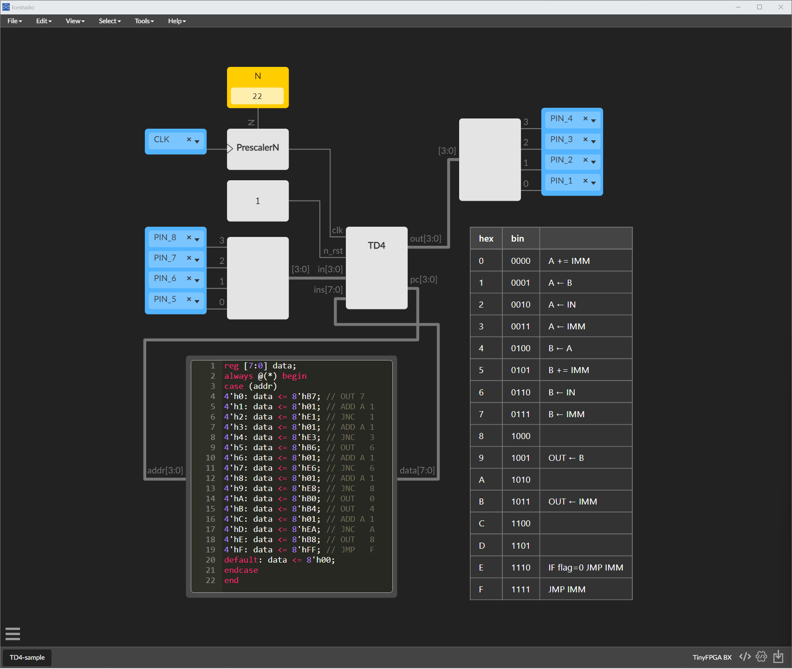

# iceTD4

TD4 CPU icestudio

| hex | bin  |                   |
| --- | ---- | ----------------- |
| 0   | 0000 | A += IMM          |
| 1   | 0001 | A ← B             |
| 2   | 0010 | A ← IN            |
| 3   | 0011 | A ← IMM           |
| 4   | 0100 | B ← A             |
| 5   | 0101 | B += IMM          |
| 6   | 0110 | B ← IN            |
| 7   | 0111 | B ← IMM           |
| 8   | 1000 |                   |
| 9   | 1001 | OUT ← B           |
| A   | 1010 |                   |
| B   | 1011 | OUT ← IMM         |
| C   | 1100 |                   |
| D   | 1101 |                   |
| E   | 1110 | IF flag=0 JMP IMM |
| F   | 1111 | JMP IMM           |

| N   | CLK [Hz] |
| --- | -------- |
| 0   | 16M      |
| 1   | 8M       |
| 2   | 4M       |
| 3   | 2M       |
| 4   | 1M       |
| 5   | 500 K    |
| 6   | 250 K    |
| 7   | 125 K    |
| 8   | 62.5 K   |
| 9   | 31.3 K   |
| 10  | 15.6 K   |
| 11  | 7.81 K   |
| 12  | 3.91 K   |
| 13  | 1.95 K   |
| 14  | 977      |
| 15  | 488      |
| 16  | 244      |
| 17  | 122      |
| 18  | 61.0     |
| 19  | 30.5     |
| 20  | 15.3     |
| 21  | 7.63     |
| 22  | 3.81     |
| 23  | 1.91     |
| 24  | 0.954    |
| 25  | 0.477    |
